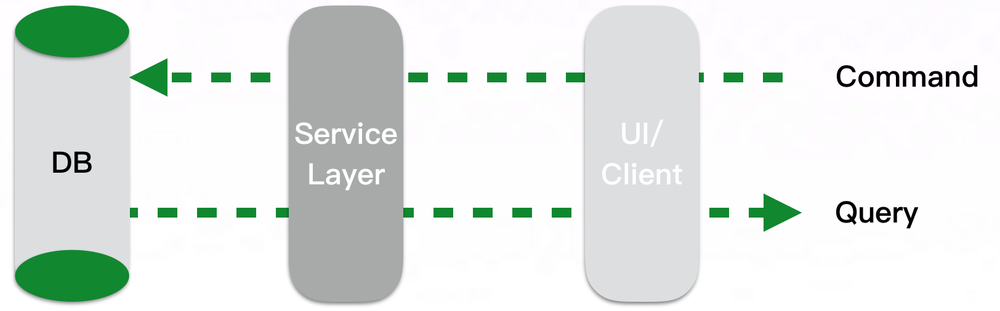
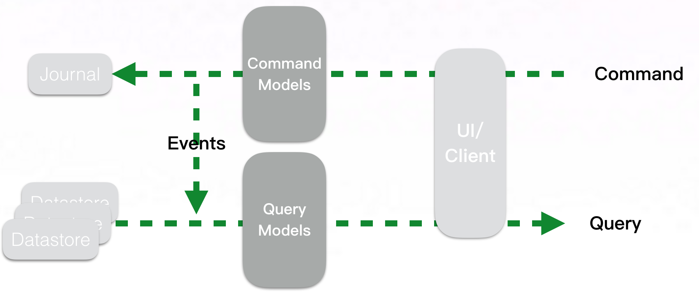
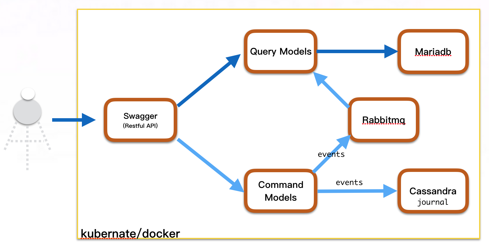

# CQRS解决方案－ v1.0

# 什么是CQRS

   CQRS代表命令查询责任分离。这是Greg Young所描述的一种模式。它的核心是您可以更新和读取信息用不同的模型。在某些情况下，这种分离可能是有价值的，对于大多数系统，CQRS增加了风险复杂性。我们与信息系统交互的主流方法是将其视为CRUD数据存储。随着需求变得越来越复杂，可能希望以不同的方式查看信息到记录存储区，也可能将多个记录折叠成一个记录，或通过组合不同位置的信息形成虚拟记录。在更新方面，我们可能会发现验证规则，只允许存储数据的某些组合，或者甚至可以推断与我们提供的数据不同的数据。

# 常见数据模型

    开发人员通常建立自己的概念模型，用于操纵模型的核心元素。如果您使用域模型，则通常是域的概念表示。通常也可以使持久存储尽可能接近概念模型。这种多层次表现的结构可能会变得相当复杂，但是当人们这样做时，他们仍然将其解决为单个概念表示
    
# CQRS数据模型

    对于许多场景，特别是在更为复杂的领域，具有相同的命令和查询概念模型导致更复杂的模型。CQRS将该概念模型分解为用于更新和显示的单独模型，它们分别遵循CommandQuerySeparation的词汇表作为命令和查询；两个模型可能不是单独的对象模型，它们可能是相同的对象在其命令端和查询方面具有不同的接口，而不是关系数据库中的视图

# CQRS特点

*Command Query Responsibility Segregation
    
*CQRS says read and write paths need to be handled separately by applications 
    
*Segregation because reads and writes almost always have very different properties in every system
   Difference in order of magnitude of each in a system
   Difference in SLA 

*Build them separately so that both can be scale. Using a singular layer like ORM for both cannot be scaled

# 如何用？

   和其它模式一样，CQRS在某些场景下很有用，但是许多系统确实适合CRUD模型，因此应该以这种风格完成。特别是CQRS只能用于系统的特定部分（DDD语言中的BoundedContext），而不是整个系统。 CQRS允许您将负载与读写分离，从而可以独立地缩放。如果您的应用程序看到读写之间的差异很大，这是非常方便的。如果您的域不适合于CQRS，但是您需要增加复杂性或性能问题的查询，请记住，您仍然可以使用ReportingDatabase。 CQRS对所有查询使用单独的模型。使用报告数据库，您仍然可以使用主系统进行大多数查询，但是将要求较高的数据分配到报告数据库。

# Event Sourcing

   事件溯源将应用程序所做的状态更改变为不可变序列或“事件日志”，而不是立刻更新应用程序的状态，事件溯源将触发状态更改的事件存储在不可变日志中，并将状态更改变为对日志中事件的响应。事件溯源能够构建前向兼容的应用程序体系结构 ，能够在将来添加更多需要处理相同事件但创建不同实体化视图的应用程序

# Event Sourcing特点

*存储所有事件变化，而不是当前状态
    
*事件发生在过去
    
*事件不可变
    
*事件是单向的
    
*没有更新、删除，只有Append Event

# How to do CQRS?

Akka allows the events created via commands to be sent across to the read side to keep read models consistent and update them quickly

# Akka Persistent Actor Plugins

*Journal

   Cassandra、Kafka、Hbase、JDBC、MongoDB、LevelDB

*Snapshots

   Cassandra、Kafka、Hbase、JDBC、MongoDB、LevelDB

# User Case

# 社群贡献
+ QQ群: 34782297
+ [联系我们](mailto:zhangb2002@163.com)
-------

遵循[APACHE LICENSE 2.0](LICENSE.md)协议发布。
